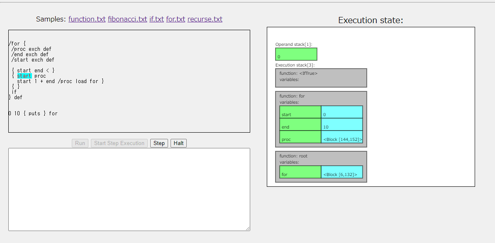
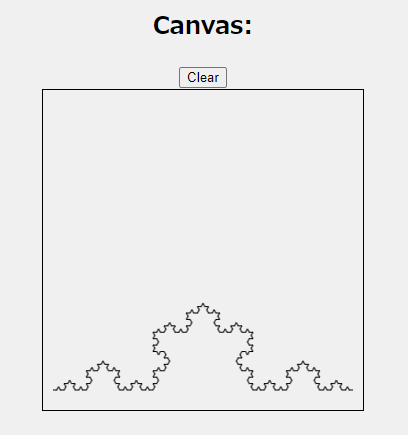

# Rustack

A very simple stack based language interpreter in Rust

Try it now on your browser!
https://msakuta.github.io/rustack/


## Overview

This is a sister project of [rusty-parser](https://github.com/msakuta/rusty-parser),
a custom programming language compiler / interpreter.

It has integrated step execution feature that visualize the interpreter state at each execution step.



The WebmAssembly deployment has API access to canvas rendering similar to PostScript graphics, so you can write
a program that can render something like below.
This example is a rendering of [Koch curve](https://en.wikipedia.org/wiki/Koch_snowflake) which uses recursive calls. You can find the source in [source](wasm/scripts/koch.txt).



This rustack is stack based virtual machine similar to JVM,
but it is particularly following the design of PostScript runtime.
It uses reverse-polish notation for all operations and functions.

For example, the following program will print `90`.

```
10 20 + 3 * puts
```

There are example source files in [examples](examples), which is step-by-step procedure
to implement such a language.
Each example source file in `examples` directory is prefixed with a number, which indicates
the step of the particular source file in the progress.

A notable difference from PostScript is that the dictionary stack and the execution stack is
the same, i.e. when you call a function, it will implicitly introduce a local namespace.

## Wasm demo

As always, I prepared a Wasm interpreter that you can play around with in your browser.
